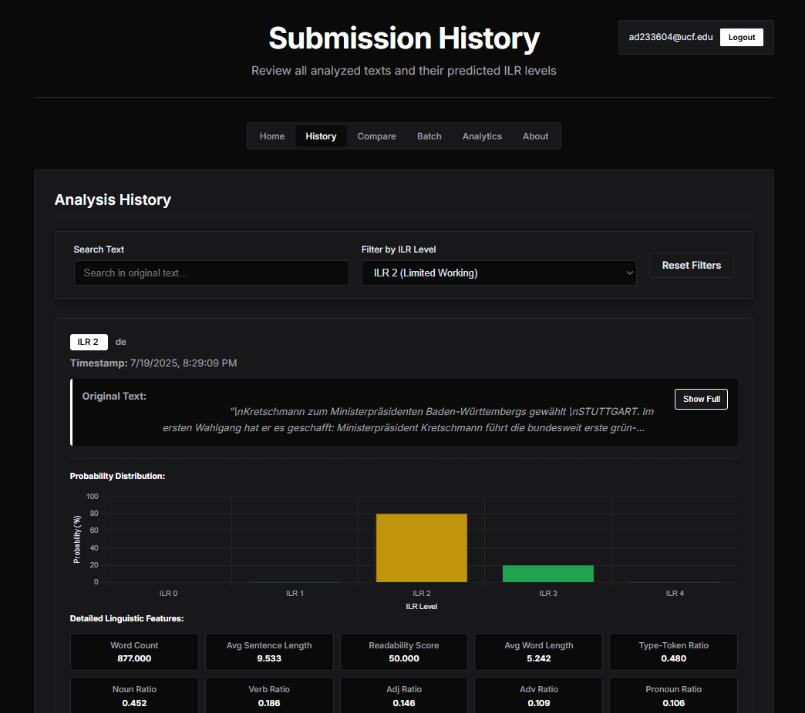
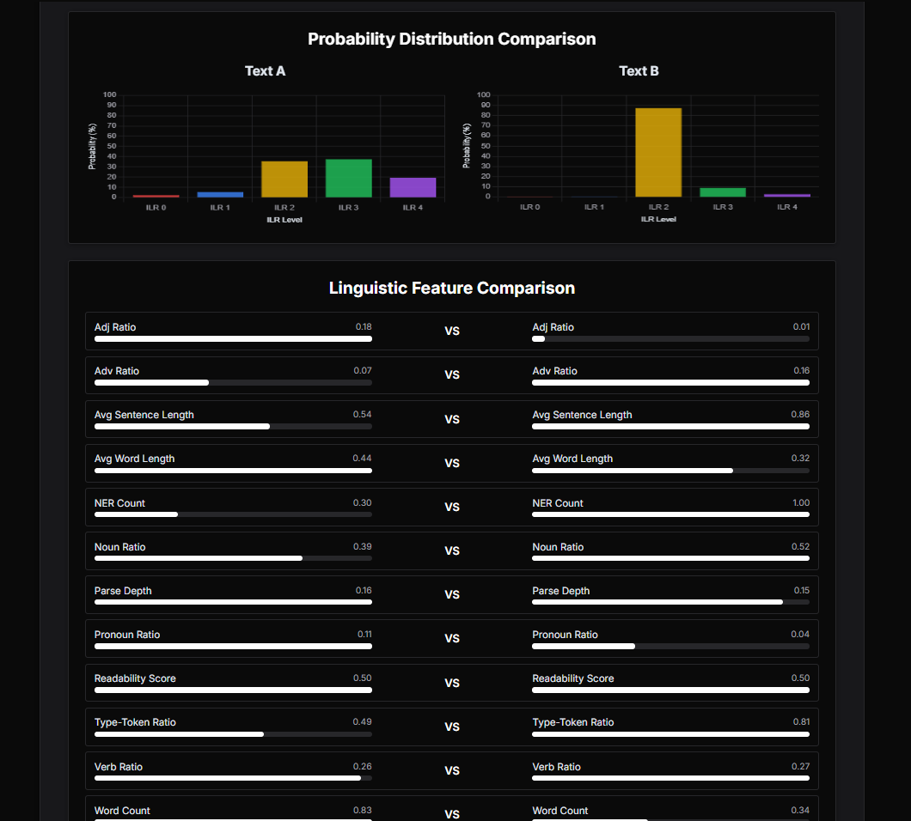
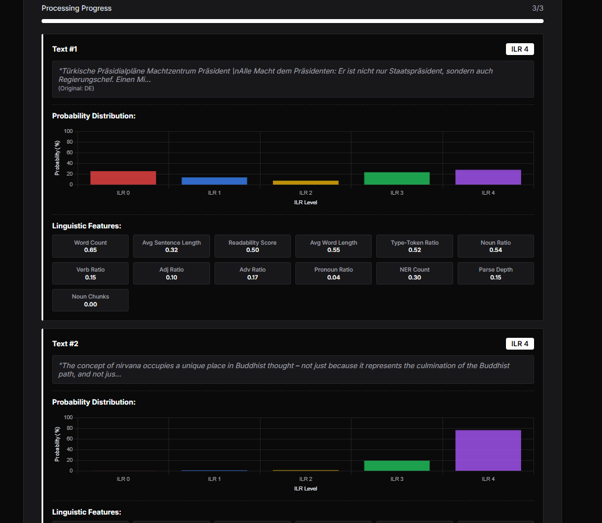
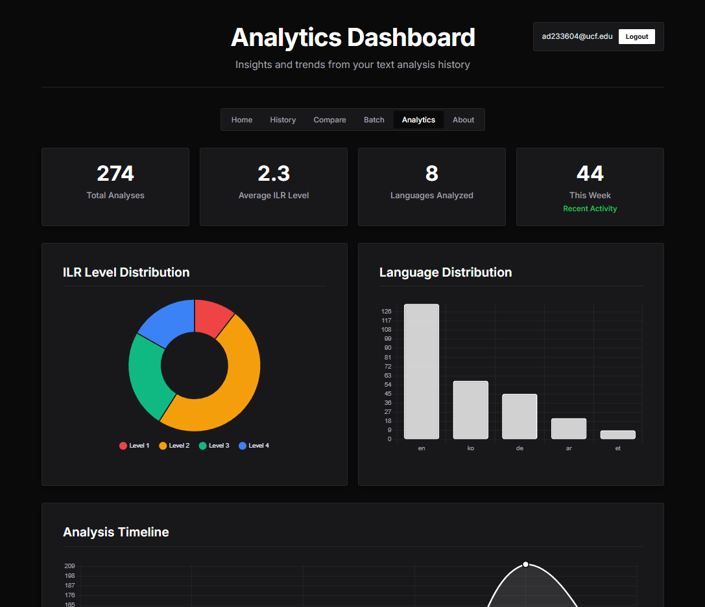

# ILR Predictor

The ILR Predictor is a deep learning-powered tool designed to analyze text complexity and linguistic features to predict the minimum Interagency Language Roundtable (ILR) proficiency level required to understand a given text. 

## Table of Contents

- [Project Overview](#project-overview)
- [Features](#features)
- [How It Works](#how-it-works)
- [Setup and Installation](#setup-and-installation)
  - [Prerequisites](#prerequisites)
  - [Environment Variables](#environment-variables)
  - [Installation Steps](#installation-steps)
- [Usage](#usage)
- [ILR Overview](#ilr-overview)
- [Important Disclaimers and Limitations](#important-disclaimers-and-limitations)
- [Credits](#credits)
- [Visual Demo](#visual-demo)

---

## Project Overview

This application serves as an advanced linguistic analysis tool that uses machine learning to assess text complexity against the Interagency Language Roundtable (ILR) scale. It aims to automate and streamline the process of evaluating language proficiency levels for written content, which can be particularly useful in educational or governmental contexts, such as aiding in the creation of DLPT (Defense Language Proficiency Test) exams... coming soon.

## Features

The ILR Predictor offers the following key functionalities:

* **Text Analysis**: Analyze individual text submissions to predict their ILR proficiency level.
* **Language Detection**: Automatically identifies the original language of the input text.
* **Multilingual Support**: Supports direct analysis for English (EN), German (DE), and Korean (KO) using specialized TensorFlow models. Texts in other languages are automatically translated to English for analysis, pending new labeled data to train in further languages.
* **Linguistic Feature Extraction**: Extracts various linguistic features such as vocabulary, syntax, readability, word count, sentence length, and Part-of-Speech (POS) ratios, purely for frontend demonstration, but to showcase the architecture of XLM-Roberta.
* **Prediction Model**: Utilizes deep learning models crafted with TensorFlow, Keras, XLM-Roberta and Cuda to predict ILR. 
* **Confidence Scoring & Visualization**: Displays probability distributions for predicted ILR levels and visualizes linguistic features to provide deeper insights into the analysis.
* **Analysis History**: Users can review their past text analyses and filter results based on search queries or ILR levels.
* **Text Comparison**: Allows side-by-side comparison of linguistic complexity and predicted ILR levels for two different texts.
* **Batch Analysis**: Supports uploading and analyzing multiple text files (`.txt` format) simultaneously, with options to export results in CSV or JSON formats, or generate a detailed MD report. 
* **Analytics Dashboard**: Provides an overview of user activity, including total analyses, average ILR levels, languages analyzed, and analysis trends over time.
* **User Authentication**: Secure login and account creation (restricted to `@ucf.edu` email addresses) using Supabase for user management and data storage.

## How It Works

The core prediction process involves several steps:

1.  **Text Input**: Users submit text via the web interface.
2.  **Language Detection**: The system first detects the language of the input text using `langdetect`.
3.  **Translation (if necessary)**: If the detected language is not English, German, or Korean, the text is automatically translated into English using the `Facebook M2M100` large multilingual translation model. Linguistic features are then extracted from this English translation.
4.  **Feature Extraction**: For English, German, or Korean texts (or their English translations), linguistic features are extracted using `spaCy` models (e.g., `en_core_web_sm`, `de_core_news_sm`, `ko_core_news_sm`) and SentenceTransformer embeddings. This includes metrics like word count, average sentence length, type-token ratio, part-of-speech ratios (noun, verb, adjective, adverb, pronoun), named entity recognition (NER) count, parse depth, and noun chunks.
5.  **Prediction**: The extracted features are fed into a pre-trained TensorFlow deep learning model (language-specific if available, otherwise the English model after translation) to predict the ILR level.
6.  **Results & Storage**: The predicted ILR level, probability distribution, and linguistic features are displayed to the user. All analysis results are stored in a Supabase database for historical tracking and analytics.

## Setup and Installation

Follow these steps to set up and run the ILR Predictor locally.

### Prerequisites

* Python 3.8+
* `pip` (Python package installer)
* `git` (for cloning the repository)
* TensorFlow models (`deep_learning_models/`) and spaCy models (will be downloaded), please reach out for handoff of deep_learning_models (too big for github), but some necessary ML code is provided if more langauges are to be implemented, reach out for language specific tokenizers as well.

### Environment Variables

The application uses environment variables for Supabase integration. Create a `.env` file in the root directory of the project (where `main.py` is located) and add the following:

SUPABASE_URL="YOUR_SUPABASE_URL"
SUPABASE_KEY="YOUR_SUPABASE_ANON_KEY"


Replace `YOUR_SUPABASE_URL` and `YOUR_SUPABASE_ANON_KEY` with your actual Supabase project URL and anonymous public key. These are necessary for user authentication and data storage.

### Installation Steps

1.  **Clone the repository:**

    ```bash
    git clone [https://github.com/acozy03/ilr_predictor.git](https://github.com/acozy03/ilr_predictor.git)
    cd ilr_predictor
    ```

2.  **Install dependencies:**
    This project uses `pip` for dependency management. Install all required packages using the `requirements.txt` file:

    ```bash
    pip install -r requirements.txt
    ```
   

3.  **Download SpaCy models:**
    The application relies on `spaCy` for linguistic feature extraction. Download the necessary models for English, German, and Korean (add more models for future support of languages if necessary, this may be too much on memory, so if provided access to external API for translation, consider translating to English as ground truth language and extracting features from the translation so memory overhead is minimal):

    ```bash
    python -m spacy download en_core_web_sm
    python -m spacy download de_core_news_sm
    python -m spacy download ko_core_news_sm
    ```
   

4.  **Place TensorFlow models:**
    The pre-trained TensorFlow models for prediction are expected to be located in a `deep_learning_models/` directory within the project root. Ensure you have these models in the correct path. The `.gitignore` file indicates that this directory is ignored in version control, meaning these models are not part of the repository and must be acquired separately and placed manually.

5.  **Run the application:**
    Start the FastAPI application using `uvicorn`:

    ```bash
    python -m uvicorn main:app --reload || uvicorn main:app (depending on environment/workspace)
    ```
    The application will typically run on `http://127.0.0.1:8000`.

## Usage

Once the application is running, you can access it via your web browser.

* **Home Page (`/`)**: Enter text for immediate ILR level prediction and view linguistic feature analysis.
* **History (`/history`)**: Browse your past text analyses, including predicted levels and detailed features. You can search and filter entries.
* **Compare (`/compare`)**: Input two texts to compare their predicted ILR levels and linguistic features side-by-side.
* **Batch Analyzer (`/batch`)**: Upload multiple `.txt` files or paste several texts to analyze them in a batch. Export results or generate a report.
* **Analytics (`/analytics`)**: View a dashboard with statistics and charts based on your overall analysis history.
* **About (`/about`)**: Learn more about the ILR scale and the methodology behind the ILR Predictor.
* **Login (`/login`)**: Sign in or request an account (UCF email required).

## ILR Overview

The **Interagency Language Roundtable (ILR)** scale is a standardized system used by the U.S. government to assess language proficiency. It describes abilities to communicate in a language across various skills. This tool's predictions align with the written proficiency descriptions:

* **Level 0: No Proficiency** - No functional writing ability.
* **Level 0+: Memorized Proficiency** - Writes using memorized material and set expressions.
* **Level 1: Elementary Proficiency** - Sufficient control of the writing system for limited practical needs.
* **Level 1+: Elementary Proficiency, Plus** - Meets most survival needs and limited social demands.
* **Level 2: Limited Working Proficiency** - Able to write routine social correspondence and documentary materials for limited work.
* **Level 2+: Limited Working Proficiency, Plus** - Writes with some precision on common topics, but may show inaccuracies under pressure.
* **Level 3: General Professional Proficiency** - Uses language effectively in most formal and informal written exchanges on practical, social, and professional topics.
* **Level 3+: General Professional Proficiency, Plus** - Able to write in a few prose styles but may lack control of low-frequency complex structures.
* **Level 4: Advanced Professional Proficiency** - Writes precisely and accurately in a variety of professional/educational prose styles.
* **Level 4+: Advanced Professional Proficiency, Plus** - Writes precisely and accurately in a wide variety of styles, with some editing ability.
* **Level 5: Native/Bilingual** - Writing proficiency equal to that of a well-educated native speaker.

(Sourced from [govtilr.org](https://www.govtilr.org/))

## Important Disclaimers and Limitations

* This ILR Level Predictor supports direct analysis for texts in **English (EN), German (DE), and Korean (KO)** using **specialized TensorFlow models**.
* For all other languages, input text will be automatically translated to English using a large multilingual translation model **(Facebook M2M100)**. The English translation will then be **analyzed by the English TensorFlow model**.
* Linguistic features (e.g., word count, sentence length) are extracted directly from the original text if it's **English, German, or Korean**. If translation occurs, these features are **extracted from the English translation**.
* This tool can **ONLY predict ILR levels 0-4 NOT INCLUDING '+' LABELS** due to specific training data provided for the supervised learning approach.
* Accuracy may vary for translated or mixed-language texts. **This tool is for educational and experimental purposes.**

## IF YOU ARE A STUDENT CONTIUING TO EXPAND THIS PROJECT...

* Please feel free to reach out to me for information regarding any questions you may have about training, the application, package conflicts, data collection, database setup, etc... 

## Credits

This project was made possible with the support of:

* [Defense Language Institute Foreign Language Center (DLIFLC)](https://www.dliflc.edu)
* [National Security Agency (NSA)](https://www.nsa.gov)
* Computer Science Department at the [University of Central Florida (UCF)](https://www.ucf.edu)


## Visual Demo 







